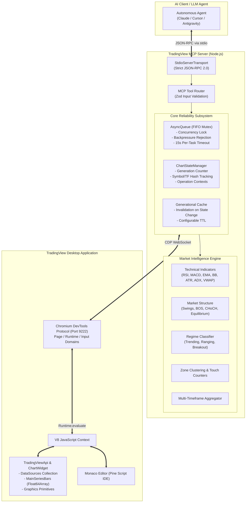

# TradingView MCP — Enterprise AI Market Intelligence & Chart Automation

[](https://modelcontextprotocol.io/)
[](https://nodejs.org/)
[](LICENSE)
[](tests/)
[](tests/e2e.test.js)
[](src/wait.js)

An enterprise-grade, concurrency-safe, observable Model Context Protocol (MCP) server providing autonomous AI agents (Claude, Cursor, Antigravity, Cline) with direct real-time programmatic control, deterministic technical analysis, and multi-timeframe market intelligence on top of **TradingView Desktop**.

---

## 📑 Table of Contents

- [Executive Overview](#-executive-overview)
- [System Architecture](#-system-architecture)
- [Core Engineering Pillars](#-core-engineering-pillars)
  - [1. Deterministic Market Intelligence Engine](#1-deterministic-market-intelligence-engine)
  - [2. Concurrency Safety & AsyncQueue Mutex](#2-concurrency-safety--asyncqueue-mutex)
  - [3. Zero Hardcoded Sleeps (Reactive CDP Automation)](#3-zero-hardcoded-sleeps-reactive-cdp-automation)
  - [4. State Generation Tracking & Cache Invalidation](#4-state-generation-tracking--cache-invalidation)
  - [5. Data Provenance & Anti-Hallucination Contracts](#5-data-provenance--anti-hallucination-contracts)
  - [6. Security & Protocol Purity](#6-security--protocol-purity)
- [Complete MCP Tool Catalog](#-complete-mcp-tool-catalog)
  - [High-Level Market Intelligence](#high-level-market-intelligence-tools)
  - [Chart Control & Navigation](#chart-control--navigation-tools)
  - [Market & Study Data Retrieval](#market--study-data-retrieval-tools)
  - [Pine Script Development & Compilation](#pine-script-development--compilation-tools)
  - [Drawing & Visual Annotations](#drawing--visual-annotation-tools)
  - [UI Automation & Window Management](#ui-automation--window-management-tools)
  - [Alerts & Watchlist Management](#alerts--watchlist-management-tools)
  - [Bar Replay & Simulation Engine](#bar-replay--simulation-engine-tools)
  - [Diagnostics, Health & Session Persistence](#diagnostics-health--session-persistence-tools)
- [Installation & Quickstart](#-installation--quickstart)
- [Antigravity Integration](#-antigravity-integration)
- [MCP Client Configurations](#-mcp-client-configurations)
  - [Claude Desktop](#claude-desktop)
  - [Cursor IDE](#cursor-ide)
  - [VS Code / Cline / Roo Code](#vs-code--cline--roo-code)
- [CLI Reference](#-cli-reference)
- [Verification & Test Architecture](#-verification--test-architecture)
- [Agent Workflow Best Practices](#-agent-workflow-best-practices)
- [Troubleshooting & FAQ](#-troubleshooting--faq)
- [License](#-license)

---

## ⚡ Executive Overview

Traditional browser automation for financial charts suffers from race conditions, DOM polling stalls, context window exhaustion, and hallucinations caused by unconfirmed/live candle values. 

**TradingView MCP** transforms TradingView Desktop into a deterministic execution engine for Large Language Models by connecting via the Chrome DevTools Protocol (CDP) directly into TradingView's internal Charting API and Monaco code editor.

### Key Capabilities
- **Direct Chart Object Binding**: Extracts exact mathematical OHLCV bars, indicator values, and custom Pine graphics directly from TradingView's in-memory data sources (`window.TradingViewApi`), bypassing DOM scraping.
- **Autonomous Pine Script IDE Integration**: Programmatically reads, edits, hot-reloads, checks errors, and compiles Pine Script v5/v6 inside TradingView's Monaco editor.
- **Native Market Structure Analysis**: Zero-dependency pure-math engine computes Swing Highs/Lows, Break of Structure (BOS), Change of Character (CHoCH), Order Blocks / Fair Value Zones, and Market Regimes natively in Node.js.
- **Token-Optimized Context**: Returns compact summaries, deduplicated price levels, and incremental delta updates, cutting LLM context window consumption by up to 90%.

---

## 🏛 System Architecture

The server establishes a non-blocking stdio JSON-RPC transport with the AI agent and mediates all communication with the Chromium runtime of TradingView Desktop via a dedicated FIFO mutex queue.



---

## 🛡 Core Engineering Pillars

### 1. Deterministic Market Intelligence Engine
The server includes a zero-dependency quantitative analysis module (`src/analysis/`) that executes mathematical models directly against confirmed historical price series:
- **Wilder's RSI**: Exact parity with J. Welles Wilder's smoothing algorithm, handling zero-loss / zero-gain boundaries strictly without floating point drift (`avgLoss === 0 ? 100 : ...`).
- **Trend & Volatility**: Exponential Moving Averages (EMA 9/20/50/200), SMA, Bollinger Bands (mean, stdDev, bandwidth, %B), and Average True Range (ATR) with True Range smoothing.
- **Directional Movement (ADX)**: Directional Movement (+DI/-DI) and smoothed Average Directional Index (ADX) to distinguish trending markets from consolidating ranges.
- **Market Structure (SMC / Price Action)**: Deterministic fractal swing detection across configurable window sizes, identifying Break of Structure (BOS), Change of Character (CHoCH), and Equilibrium / Discount / Premium zones.
- **Volume Anomalies & Divergences**: Relative volume (RVOL) standard deviation scoring and oscillator divergences (Regular Bullish/Bearish, Hidden Bullish/Bearish).

### 2. Concurrency Safety & AsyncQueue Mutex
TradingView's internal charting framework cannot process concurrent asynchronous evaluations from different threads without risking state corruption or target session disconnection.
- **Strict FIFO Serialization**: All calls to `evaluate()` and `evaluateAsync()` are queued through an `AsyncQueue` mutex lock.
- **Backpressure Protection**: The queue enforces a maximum backlog depth (`maxDepth: 100`). If an agent attempts to flood the server, tasks are rejected immediately with a structured `[Queue_BACKPRESSURE]` error rather than exhausting memory.
- **Per-Task Timeouts**: Every CDP operation has an individual 15-second timeout with an `AbortController` signal to prevent queue starvation.

### 3. Zero Hardcoded Sleeps (Reactive CDP Automation)
All legacy artificial timeouts (`setTimeout(500)`, `setTimeout(2500)`) have been eliminated.
- Operations utilize reactive predicate polling (`waitForCondition`) with 50ms intervals.
- The server yields control back to the agent the exact millisecond the chart acknowledges a symbol change, indicator attachment, or Monaco editor initialization.
- Saves up to 20 seconds during multi-timeframe scans and chart switching.

### 4. State Generation Tracking & Cache Invalidation
To prevent race conditions where an agent reads bar data while a timeframe change is still resolving:
- **Generation IDs**: Every change to symbol, timeframe, or chart layout increments an atomic `generation` counter on the `ChartStateManager`.
- **Generational Cache**: Cached indicator and OHLCV data are tagged with the active generation ID. When a state change occurs, all stale generational cache entries are instantly purged.
- **Cross-Contamination Guards**: Tools like `data_get_ohlcv` and `market_get_context` accept `expectedSymbol` and `expectedTf`. If the chart has not yet finished transitioning, the call throws a classified retryable `STALE_CHART_STATE` error.

### 5. Data Provenance & Anti-Hallucination Contracts
LLMs frequently hallucinate because live (unclosed) candles fluctuate after tool execution.
- **`barClosed` Separation**: Every bar returned by `data_get_ohlcv` contains a boolean `barClosed` flag.
- **`closedOnly` Option**: Agents can request `closedOnly: true` to strip out the forming candle entirely, guaranteeing that backtests, pattern recognition, and indicators operate exclusively on immutable data.
- **Token Efficiency**: In addition to full arrays, `data_get_ohlcv` provides `summary: true` mode returning high, low, open, close, volume, and range statistics in < 1KB of JSON.

### 6. Security & Protocol Purity
- **JS Injection Defense (CWE-94 / CWE-116)**: All user inputs (symbols, timeframes, script names, Pine code) are strictly serialized with `JSON.stringify()` before interpolation into CDP evaluate scripts.
- **Stdout Protocol Purity**: In MCP, stdout is exclusively reserved for JSON-RPC framing. Any diagnostic message, warning, or debug log is routed strictly to `process.stderr`.

---

## 🧰 Complete MCP Tool Catalog

The server exposes 76 purpose-built MCP tools categorized across 9 functional domains.

### High-Level Market Intelligence Tools
Designed specifically for AI agents to comprehend market structure and context in a single call.

| Tool Name | Key Parameters | Description |
| :--- | :--- | :--- |
| `market_get_context` | `candleCount`, `includeZones`, `includeIndicators`, `includeStructure`, `expectedSymbol`, `expectedTf` | **One-stop analytical call**: returns market trend, regime (TRENDING/RANGING/BREAKOUT), key indicators (RSI, MACD, BB, ATR, ADX, VWAP), volume anomalies, structure (swings, BOS, CHoCH), and support/resistance zones. |
| `market_detect_structure` | `candleCount` | Detects swing highs/lows, higher highs/lows (HH/HL/LH/LL), Break of Structure (BOS), Change of Character (CHoCH), and range equilibrium. |
| `market_detect_zones` | `candleCount`, `touchThreshold` | Clusters price levels into horizontal support and resistance zones with touch counts, strength scores, and boundaries. |
| `market_compare_timeframes` | `symbol`, `timeframes` | Evaluates multi-timeframe alignment across resolutions (e.g., 1D, 4H, 1H, 15m), scoring bullish/bearish consensus. |
| `market_get_recent_changes` | `sinceTimestamp` | Low-token incremental delta polling: returns only new swings, structure breakouts, and volume anomalies since previous turn. |
| `chart_get_state_diagnostics` | _none_ | Authoritative diagnostic snapshot of connection liveness, queue depth, active generation ID, and chart readiness. |

### Chart Control & Navigation Tools

| Tool Name | Key Parameters | Description |
| :--- | :--- | :--- |
| `chart_get_state` | _none_ | Returns current chart state: symbol, timeframe, chart style, and list of all attached study entities with IDs. |
| `chart_set_symbol` | `symbol` (e.g., `"BTCUSD"`, `"AAPL"`) | Changes the active chart symbol and waits for data feed confirmation. |
| `chart_set_timeframe` | `timeframe` (e.g., `"1"`, `"5"`, `"15"`, `"60"`, `"D"`, `"W"`) | Changes chart resolution and waits reactively for candle resolution. |
| `chart_set_type` | `chart_type` (e.g., `"Candles"`, `"Bars"`, `"Line"`, `"HeikinAshi"`) | Sets chart rendering style. |
| `chart_manage_indicator` | `action` (`"add"`/`"remove"`), `indicator`, `entity_id`, `inputs` | Adds or removes indicators on the chart. Requires full official name (e.g., `"Relative Strength Index"`). |
| `chart_get_visible_range` | _none_ | Returns Unix timestamps and bar index boundaries for currently visible canvas. |
| `chart_set_visible_range` | `from`, `to` (Unix seconds) | Zooms and pans chart viewport to specific time range. |
| `chart_scroll_to_date` | `date` (ISO date or Unix timestamp) | Jumps chart viewport to center on a target date. |
| `symbol_info` | _none_ | Fetches full instrument metadata (exchange, tick size, currency, market hours). |
| `symbol_search` | `query`, `type` | Searches TradingView symbol database for matching tickers and exchanges. |
| `chart_get_snapshot` | _none_ | Returns atomic state snapshot: active symbol, resolution, bar count, last bar time, generation ID. |
| `chart_get_multi_timeframe` | `symbol`, `timeframes`, `count` | Performs atomic scan fetching OHLCV bars across multiple resolutions sequentially without race conditions. |

### Market & Study Data Retrieval Tools

| Tool Name | Key Parameters | Description |
| :--- | :--- | :--- |
| `data_get_ohlcv` | `count`, `summary`, `closedOnly`, `expectedSymbol`, `expectedTf` | Fetches historical price bars with provenance metadata, `barClosed` flags, or compact statistical summary. |
| `data_get_indicator` | `entity_id` | Reads internal parameters, input values, and configurations of a specific study entity. |
| `data_get_strategy_results`| _none_ | Scrapes Strategy Tester metrics: net profit, Sharpe ratio, max drawdown, win rate, profit factor. |
| `data_get_trades` | `max_trades` | Retrieves trade list from Strategy Tester (entry/exit times, prices, P&L, contracts). |
| `data_get_equity` | _none_ | Extracts equity curve points from Strategy Tester. |
| `quote_get` | `symbol` | Fetches instantaneous quote (last price, day open/high/low/close, change %, volume). |
| `depth_get` | _none_ | Extracts Depth of Market (DOM) / order book bids and asks (requires DOM panel open). |
| `data_get_pine_lines` | `study_filter`, `verbose` | Reads horizontal price levels drawn programmatically by Pine Script indicators (`line.new`). |
| `data_get_pine_labels` | `study_filter`, `max_labels`, `verbose` | Reads text labels drawn by Pine Script indicators (`label.new`) with price positions. |
| `data_get_pine_tables` | `study_filter` | Extracts cell contents and tabular matrices drawn by Pine Script indicators (`table.new`). |
| `data_get_pine_boxes` | `study_filter`, `verbose` | Reads bounding boxes and price zones drawn by Pine Script indicators (`box.new`). |
| `data_get_study_values` | _none_ | Reads real-time numeric output values for all visible indicators from the chart Data Window. |

### Pine Script Development & Compilation Tools

| Tool Name | Key Parameters | Description |
| :--- | :--- | :--- |
| `pine_get_source` | _none_ | Reads source code currently open in TradingView's Pine Editor Monaco instance. |
| `pine_set_source` | `source` | Injects Pine Script code directly into Monaco editor model. |
| `pine_compile` | _none_ | Dispatches compilation ("Add to Chart" / "Save"). |
| `pine_smart_compile` | `source` | Atomic developer loop: injects code, triggers compilation, and polls Monaco markers for syntax errors. |
| `pine_get_errors` | _none_ | Retrieves compiler error messages and line-number markers from Monaco editor. |
| `pine_get_console` | _none_ | Reads log output from Pine Script console / runtime log window. |
| `pine_save` | _none_ | Triggers Ctrl+S shortcut inside Pine Editor. |
| `pine_new` | `type` (`"indicator"`/`"strategy"`) | Creates a clean new Pine Script draft from template. |
| `pine_open` | `name` | Opens a saved Pine script by name from user library. |
| `pine_list_scripts` | _none_ | Lists all user scripts stored in TradingView account library. |
| `pine_analyze` | `source` | Offline static analysis: detects array out-of-bounds, lookahead bias, uninitialized variables, and version deprecations. |
| `pine_check` | `source` | Server-side headless compilation check via TradingView cloud compiler API without touching the UI. |

### Drawing & Visual Annotation Tools

| Tool Name | Key Parameters | Description |
| :--- | :--- | :--- |
| `draw_shape` | `type`, `points`, `properties` | Creates drawing primitives on chart: `"horizontal_line"`, `"trend_line"`, `"rectangle"`, `"text"`, `"ray"`. |
| `draw_list` | _none_ | Lists all user drawings currently active on chart with IDs and coordinates. |
| `draw_get_properties` | `shape_id` | Reads styling, color, line width, and coordinates of an existing drawing. |
| `draw_remove_one` | `shape_id` | Deletes a specific drawing by ID. |
| `draw_clear` | _none_ | Clears all user drawings from chart. |

### UI Automation & Window Management Tools

| Tool Name | Key Parameters | Description |
| :--- | :--- | :--- |
| `ui_click` | `selector`, `aria_label`, `text` | Clicks a TradingView UI element matching selector or aria label. |
| `ui_open_panel` | `panel` (`"pine-editor"`, `"strategy-tester"`, etc.) | Toggles bottom dock panel open or closed. |
| `ui_fullscreen` | _none_ | Toggles chart full-screen view. |
| `layout_list` | _none_ | Lists saved chart layouts in user profile. |
| `layout_switch` | `name` | Switches active workspace to another saved layout. |
| `ui_keyboard` | `key`, `modifiers` | Dispatches native keyboard event (e.g., shortcuts). |
| `ui_type_text` | `text` | Types text characters directly via CDP Input domain. |
| `ui_hover` | `selector`, `x`, `y` | Dispatches mouse move event to trigger tooltips. |
| `ui_scroll` | `delta_x`, `delta_y` | Dispatches mouse wheel scroll events across chart canvas. |
| `ui_mouse_click` | `x`, `y`, `button` | Clicks exact coordinate on viewport. |
| `ui_find_element` | `query` | Locates UI element and returns bounding box coordinates. |
| `ui_evaluate` | `expression` | Evaluates arbitrary JavaScript expression in page context. |
| `pane_list` | _none_ | Lists split-view chart panes in multi-chart layouts. |
| `pane_set_layout` | `layout` (e.g., `"2h"`, `"2v"`, `"4"`) | Configures multi-pane grid layout. |
| `pane_focus` | `index` | Switches focus to a specific chart pane. |
| `pane_set_symbol` | `pane_index`, `symbol` | Sets symbol on an unfocused pane. |
| `tab_list` | _none_ | Lists all open TradingView Desktop window tabs. |
| `tab_new` | `url` | Opens a new desktop tab. |
| `tab_close` | `tab_id` | Closes a desktop tab. |
| `tab_switch` | `tab_id` | Switches active window focus to target tab. |

### Alerts & Watchlist Management Tools

| Tool Name | Key Parameters | Description |
| :--- | :--- | :--- |
| `alert_create` | `condition`, `price`, `message` | Opens TradingView alert dialog and creates price alert. |
| `alert_list` | _none_ | Scrapes active alert triggers and configurations from Alert panel. |
| `alert_delete` | `delete_all` | Deletes alerts via context menu. |
| `watchlist_get` | _none_ | Scrapes all symbols and quote changes from active watchlist. |
| `watchlist_add` | `symbol` | Adds a symbol to current watchlist. |

### Bar Replay & Simulation Engine Tools

| Tool Name | Key Parameters | Description |
| :--- | :--- | :--- |
| `replay_start` | `date` | Enters Bar Replay mode at a historical start timestamp. |
| `replay_step` | _none_ | Advances replay forward by exactly one bar. |
| `replay_autoplay` | `speed` | Toggles automatic bar playback with speed configuration. |
| `replay_trade` | `action` (`"buy"`/`"sell"`), `qty` | Executes simulated market order in replay session. |
| `replay_status` | _none_ | Returns current bar timestamp and position in replay. |
| `replay_stop` | _none_ | Exits replay mode and restores real-time feed. |

### Diagnostics, Health & Session Persistence Tools

| Tool Name | Key Parameters | Description |
| :--- | :--- | :--- |
| `tv_health_check` | _none_ | Verifies CDP connection liveness, page responsiveness, and port binding. |
| `tv_discover` | _none_ | Scans local machine for open Chrome DevTools debugging targets. |
| `tv_ui_state` | _none_ | Detects visible dialogs, active bottom panels, and error modals. |
| `tv_launch` | `port` | Automatically locates and starts TradingView Desktop with `--remote-debugging-port`. |
| `batch_run` | `symbols`, `timeframes`, `action` | Executes an analytical action sequentially across multiple symbols/resolutions. |
| `capture_screenshot` | `region` (`"full"`, `"chart"`, `"strategy_tester"`) | Captures lossless screenshot to disk and returns local file path (not base64, preserving tokens). |
| `indicator_set_inputs` | `entity_id`, `inputs` | Programmatically overrides settings (length, smoothing) of an indicator. |
| `indicator_toggle_visibility` | `entity_id` | Toggles visibility of an indicator on canvas. |
| `morning_brief` | `symbols` | Generates a multi-asset market opening briefing. |
| `session_save` | `name` | Serializes current chart view, indicators, and symbols to local session file. |
| `session_get` | `name` | Restores a saved workspace state. |

---

## 🚀 Installation & Quickstart

### 1. Prerequisites
- **Node.js**: v18.0.0 or higher
- **TradingView Desktop**: Installed on Windows, macOS, or Linux

### 2. Install Dependencies
```bash
git clone https://github.com/MohamedAmineBenGhouizia/trading-view-mcp.git
cd trading-view-mcp
npm install
```

### 3. Build Executable Shim
```bash
npm run build
```
This generates `build/index.js` with proper executable permissions (`0o755`).

### 4. Launch TradingView Desktop with Remote Debugging
TradingView Desktop must run with the Chrome DevTools Protocol port enabled (`9222`).

#### Windows
```powershell
# Default installation path
& "$env:LOCALAPPDATA\Programs\TradingView\TradingView.exe" --remote-debugging-port=9222

# Or if installed in custom directory:
& "C:\Users\<YourUser>\Downloads\TradingView\TradingView.exe" --remote-debugging-port=9222
```

#### macOS
```bash
/Applications/TradingView.app/Contents/MacOS/TradingView --remote-debugging-port=9222
```

#### Linux
```bash
tradingview --remote-debugging-port=9222
```

> **Automated Startup**: Alternatively, call the `tv_launch` tool or run `node bin/tv.js launch`, which searches standard process tables and file paths to start TradingView automatically.

---

---

## 🚀 Antigravity Integration

TradingView MCP integrates seamlessly into Google Antigravity and Gemini Code Assist as a native Model Context Protocol provider.

### 1. Configuration Path
Antigravity discovers MCP servers from either the user global configuration or project workspace configuration:
- **Global Config**: `~/.gemini/config/mcp_config.json` (or `%USERPROFILE%\.gemini\config\mcp_config.json` on Windows)
- **Symbolic Link**: `~/.gemini/antigravity/mcp_config.json`
- **IDE Config**: `~/.gemini/antigravity-ide/mcp_config.json`

### 2. Canonical Server Definition
Ensure your `mcp_config.json` registers `tradingview-mcp-jackson` pointing to the canonical `src/server.js` entrypoint:

```json
{
  "mcpServers": {
    "tradingview-mcp-jackson": {
      "command": "node",
      "args": [
        "/absolute/path/to/trading-view-mcp/src/server.js"
      ],
      "env": {
        "DEBUG_TV_MCP": "false"
      }
    }
  }
}
```
*(On Windows, use forward slashes or escaped backslashes, e.g. `C:/Users/<Username>/Downloads/development/tradingview-mcp-jackson/src/server.js`)*.

### 3. Prerequisites & CDP Requirements
- **Runtime**: Node.js `>= 18.0.0` available on system PATH.
- **Port Exposure**: TradingView Desktop must be launched with `--remote-debugging-port=9222`.
- **Chart Tab**: Ensure at least one chart tab is open on `tradingview.com/chart/` within the desktop app.

### 4. How to Verify Connection in Antigravity
When Antigravity starts or refreshes its tool environment:
1. It reads `mcp_config.json` and starts `node src/server.js`.
2. The server outputs its initial warning banners to `stderr`, keeping `stdout` completely clean for standard JSON-RPC 2.0 messages.
3. Antigravity performs the protocol handshake and automatically lists and registers lazy tool schemas in `~/.gemini/antigravity/mcp/tradingview-mcp-jackson/*.json`.

To smoke-test the live integration directly within Antigravity or a terminal:
```bash
node scripts/smoke_test.js
```
Expected output:
```text
✓ Initialize succeeded. Server: tradingview v2.1.0
✓ tools/list succeeded. Discovered 89 registered MCP tools.
✓ Verified presence of all mandatory tools in tool catalog.
✓ pine_analyze executed cleanly: success=true, issues=0
✓ SMOKE TEST COMPLETE: All MCP handshake, tool discovery, and tool call verifications passed.
```

### 5. Troubleshooting Antigravity Connections
| Issue | Underlying Cause | Resolution |
| :--- | :--- | :--- |
| `Tool not found` in Antigravity | Tool schema missing in `~/.gemini/antigravity/mcp/tradingview-mcp-jackson` | Run `node scripts/sync_antigravity_schemas.js` to refresh all JSON schemas. |
| `ECONNREFUSED 127.0.0.1:9222` | TradingView Desktop not started with remote debugging | Launch with `--remote-debugging-port=9222` or run `tv_launch` tool. |
| `STALE_CHART_STATE` | Chart was navigating while an agent tool executed | Safe retryable condition; retry the tool call after 100ms. |
| `Process exited with code 1` | Node.js syntax error or bad file path in config | Run `npm run verify` to validate syntax and verify path in `mcp_config.json`. |

---

## 🔌 MCP Client Configurations

### Canonical Runtime Entrypoint
The canonical runtime entrypoint for all clients is **`src/server.js`**.  
*(Note: `build/index.js` is also maintained as an executable forwarder for backwards compatibility).*

### Claude Desktop
Add to your `claude_desktop_config.json`:
- **macOS**: `~/Library/Application Support/Claude/claude_desktop_config.json`
- **Windows**: `%APPDATA%\Claude\claude_desktop_config.json`

```json
{
  "mcpServers": {
    "tradingview": {
      "command": "node",
      "args": [
        "/path/to/trading-view-mcp/src/server.js"
      ]
    }
  }
}
```

### Cursor IDE
Add to Cursor Settings ➔ Features ➔ MCP Servers ➔ Add New MCP Server:
- **Name**: `tradingview`
- **Type**: `command`
- **Command**: `node /path/to/trading-view-mcp/src/server.js`

### VS Code / Cline / Roo Code
In `.vscode/cline_mcp_settings.json`:
```json
{
  "mcpServers": {
    "tradingview": {
      "command": "node",
      "args": ["/path/to/trading-view-mcp/src/server.js"]
    }
  }
}
```

---

## 💻 CLI Reference

The repository provides a standalone CLI binary (`bin/tv.js`) for scripting, CI pipelines, and manual testing.

```bash
# Print general help and available commands
node bin/tv.js --help

# Perform offline static analysis of a Pine Script file
node bin/tv.js pine analyze --file ./strategies/momentum.pine

# Headless compilation check via TradingView cloud compiler
node bin/tv.js pine check --file ./strategies/momentum.pine

# Fetch real-time OHLCV data summary
node bin/tv.js ohlcv --count 50 --summary

# Fetch real-time quote for a symbol
node bin/tv.js quote BTCUSD

# Launch TradingView Desktop with CDP enabled
node bin/tv.js launch --port 9222
```

---

## 🧪 Verification & Test Architecture

The repository enforces a non-skipping, deterministic test pyramid with 100% automated verification.

```
                  ┌────────────────────────┐
                  │    E2E Tests (79)      │  Full Live TradingView Desktop Test
                  │  (tests/e2e.test.js)   │  CDP Automation, UI, Monaco, Replay
                  └───────────┬────────────┘
                              │
                  ┌───────────┴────────────┐
                  │ Integration Tests (3)  │  Market Context Orchestration,
                  │(tests/integration.js)  │  MTF Synthesis, Error Contracts
                  └───────────┬────────────┘
                              │
         ┌────────────────────┴────────────────────┐
         │            Unit Test Suites (79)        │
         ├─────────────────────────────────────────┤
         │ • Technical Indicators & Math (11 tests)│
         │ • Concurrency & Mutex Queue (6 tests)   │
         │ • Chaos & Cross-Contamination (5 tests) │
         │ • Pine Static Analysis (13 tests)       │
         │ • Headless Cloud Compiler (3 tests)     │
         │ • Market Structure & Regimes (7 tests)  │
         │ • State Manager & Generational Cache (7)│
         │ • Security JS Serialization (2 tests)   │
         │ • Error Contract Standards (5 tests)    │
         │ • Zones, Profiles & Divergences (3)     │
         │ • CLI Help & Flag Routing (13 tests)    │
         └─────────────────────────────────────────┘
```

### Available Test Scripts
| Script | Command | Purpose |
| :--- | :--- | :--- |
| `npm run lint` | `node scripts/lint.js` | Syntactic validation of all 87 source and test files using `node --check`. |
| `npm run build` | `node scripts/build.js` | Deterministically generates `build/index.js` shim with proper permissions. |
| `npm run test:unit` | `node --test tests/market_*.js ...` | Runs all 12 isolated unit test suites (no external dependencies). |
| `npm run test:integration` | `node --test tests/integration.test.js` | Validates multi-step market intelligence pipelines and error envelopes. |
| `npm run test:cli` | `node --test tests/cli.test.js` | Verifies command routing and static analyzer CLI flags. |
| `npm run test:all` | `node --test tests/*.test.js` | Executes all 82 unit, integration, and chaos test suites in sequence. |
| `npm run test:e2e` | `node --test tests/e2e.test.js` | Runs all 79 live E2E tests against TradingView Desktop on port 9222. |
| `npm run verify` | `node scripts/verify.js` | One-shot CI/CD gatekeeper: runs `lint` ➔ `build` ➔ `unit` ➔ `integration`. |

---

## 🧠 Agent Workflow Best Practices

When integrating this MCP server into autonomous LLM agents, adhere to the following workflow patterns:

### Pattern 1: Initial Chart Orientation
```
1. Call `market_get_context(expectedSymbol="BTCUSD", expectedTf="60")`
   └── Receives trend, regime, RSI, MACD, structure (BOS/CHoCH), and S/R zones.
2. If state is STALE_CHART_STATE:
   └── Retry after 100ms (chart transition was in progress).
3. Formulate analysis or trading plan based on confirmed closed bars.
```

### Pattern 2: Multi-Timeframe Consensus
```
1. Call `market_compare_timeframes(timeframes=["D", "240", "60", "15"])`
   └── Evaluates higher-timeframe trend vs lower-timeframe entry trigger.
2. Inspect `alignment`: check whether momentum and structure agree.
```

### Pattern 3: Pine Script Iterative Development Loop
```
1. Call `pine_get_source` to read existing script.
2. Formulate improvements or fixes.
3. Call `pine_smart_compile(source=code)`
   └── Injects code into Monaco editor and checks for compiler errors.
4. If errors returned:
   └── Inspect line numbers and error strings, repair code, and re-compile.
5. If success:
   └── Call `data_get_strategy_results` to evaluate backtest P&L and Sharpe ratio.
```

### Pattern 4: Low-Token Monitoring
```
1. Call `market_get_recent_changes(sinceTimestamp=lastPollTime)`
   └── Emits only new swing points, confirmed BOS events, or volume anomalies.
   └── Consumes minimal context window tokens.
```

---

## ❓ Troubleshooting & FAQ

#### Q: Error: "Could not connect to TradingView via CDP (port 9222)"
- **Cause**: TradingView Desktop is either not running or was launched without the `--remote-debugging-port=9222` flag.
- **Fix**: Run `tv_launch` via MCP, or terminate TradingView and start it from terminal with `--remote-debugging-port=9222`. Ensure no conflicting browser is using port 9222.

#### Q: Error: "[Queue_BACKPRESSURE] Task queue backlog exceeded max depth"
- **Cause**: The AI agent issued more than 100 concurrent asynchronous tool calls without awaiting responses.
- **Fix**: Ensure your agent uses sequential or bounded parallel tool calling. The AsyncQueue prevents memory leaks by shedding excess tasks.

#### Q: Error: "OHLCV data symbol mismatch: expected AAPL, got BTCUSD"
- **Cause**: `data_get_ohlcv` was invoked with `expectedSymbol="AAPL"`, but the chart was still rendering `"BTCUSD"`.
- **Fix**: The tool's anti-cross-contamination guard worked as intended. The agent should call `chart_set_symbol("AAPL")` and await completion before requesting bars.

#### Q: How do I read lines and levels drawn by my custom indicator?
- **Fix**: Use `data_get_pine_lines` with `study_filter="<IndicatorName>"`. The tool inspects TradingView's internal `_graphics` primitives and returns clean, deduplicated price levels.

---

## 📝 License

This project is licensed under the MIT License. See [LICENSE](LICENSE) for details.
Based on architectural foundations by [@tradesdontlie] and [LewisWJackson], re-engineered for high-performance agentic autonomy.